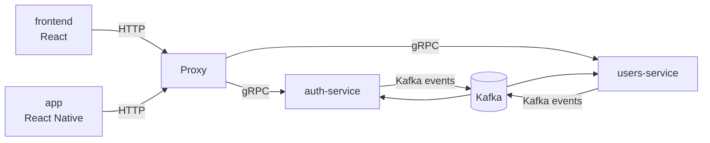

# Architecture

## Monorepo

Everything lives in this single repo, split into three areas:

- `backend/` — Go microservices, one folder per service, plus the `shared` Go library.
- `frontend/` — the React + TypeScript web client.
- `app/` — the React Native (Expo) mobile client, targeting iOS and Android.

Rationale: solo project, shared tooling and CI, easy cross-cutting refactors
while the platform takes shape.

## Communication rules

- **gRPC** for synchronous service-to-service calls (e.g. proxy-service → auth-service token validation).
- **Kafka** for asynchronous events and side-effects (e.g. `user.created` consumed by downstream services).
- **HTTP** exists only at the edge: `proxy-service` terminates public HTTP and forwards to internal gRPC services.
- Services never share a database; data crosses service boundaries only via gRPC or Kafka events.

## Service map

The React frontend and the React Native app talk only to `proxy-service` over
HTTP; neither reaches backend services directly.

## Backend services (`backend/`)

| Service | Responsibility | Sync API | Events | Status |
|---|---|---|---|---|
| proxy-service | Public HTTP entrypoint, routing, HTTP→gRPC translation | HTTP (public) | none | scaffolded — /healthz only |
| auth-service | AuthN: login, JWT issue/refresh, token validation | gRPC | publishes auth events (TBD) | planned |
| users-service | User profiles and account data | gRPC | publishes/consumes user events (TBD) | planned |
| shared | Library, not a service: proto, models (per-service), gRPC clients, db helpers, middleware, error types, logging, kafka helpers, config | n/a | n/a | planned |

## Frontend (`frontend/`)

React + TypeScript (Vite) single-page app. Consumes the platform through
`proxy-service`'s public HTTP API. Conventions in `FRONTEND_STANDARDS.md`.

## App (`app/`)

React Native (Expo, managed workflow) + TypeScript, targeting iOS and
Android. Consumes the platform through `proxy-service`'s public HTTP API,
same as `frontend/`. Conventions in `APP_STANDARDS.md`.

## Deployment

Each backend service ships as its own Docker image (Dockerfile at the service
folder root). The frontend builds to static assets served from its own image.
The app builds to a static web export (`expo export --platform web`) served
from its own image — this is a **web-preview only**, useful for the Visual
check gate and for seeing the app run without a simulator; it is not how the
app ships to a device. Real device/simulator testing is a separate manual
workflow (`npx expo start`, scan the QR code or open a simulator), never
part of the compose stack. `react-native-web` rendering approximates native
rendering (safe areas, native chrome, and platform-specific components
don't render identically) — the web-preview catches layout/token
regressions, not native-fidelity bugs.

The whole platform runs from a **single root `docker-compose.yaml`**: one
`docker compose up` brings up every backend service plus the frontend and
the app web-preview. Each new runnable component registers itself in that
file, so the full stack is always runnable with one command.
