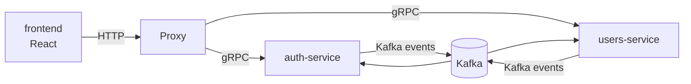

# Architecture

## Monorepo

Everything lives in this single repo, split into two areas:

- `backend/` — Go microservices, one folder per service, plus the `shared` Go library.
- `frontend/` — the React + TypeScript client.

Rationale: solo project, shared tooling and CI, easy cross-cutting refactors
while the platform takes shape.

## Communication rules

- **gRPC** for synchronous service-to-service calls (e.g. proxy-service → auth-service token validation).
- **Kafka** for asynchronous events and side-effects (e.g. `user.created` consumed by downstream services).
- **HTTP** exists only at the edge: `proxy-service` terminates public HTTP and forwards to internal gRPC services.
- Services never share a database; data crosses service boundaries only via gRPC or Kafka events.

## Service map

The React frontend talks only to `proxy-service` over HTTP; it never reaches backend
services directly.

## Backend services (`backend/`)

| Service | Responsibility | Sync API | Events | Status |
|---|---|---|---|---|
| proxy-service | Public HTTP entrypoint, routing, HTTP→gRPC translation | HTTP (public) | none | scaffolded — /healthz only |
| auth-service | AuthN: login, JWT issue/refresh, token validation | gRPC | publishes auth events (TBD) | planned |
| users-service | User profiles and account data | gRPC | publishes/consumes user events (TBD) | planned |
| shared | Library, not a service: logging, kafka helpers, config, error types | n/a | n/a | planned |

## Frontend (`frontend/`)

React + TypeScript (Vite) single-page app. Consumes the platform through
`proxy-service`'s public HTTP API. Conventions in `FRONTEND_STANDARDS.md`.

## Deployment

Each backend service ships as its own Docker image (Dockerfile at the service
folder root). The frontend builds to static assets served from its own image.

The whole platform runs from a **single root `docker-compose.yaml`**: one
`docker compose up` brings up every backend service plus the frontend. Each new
runnable component registers itself in that file, so the full stack is always
runnable with one command.
