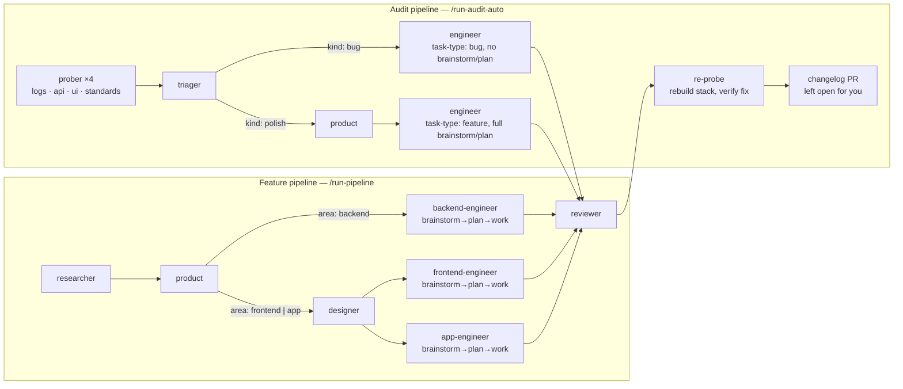

# Agent Pipeline

A document-driven pipeline of Claude Code subagents, covering two flows: a
feature pipeline that carries an idea from web research to a merged pull
request, and an audit pipeline that probes the running stack and fixes what
it finds:



Each stage reads the previous stage's markdown artifact and writes its own. An
orchestrator slash command, run from your main session, dispatches the
subagents for its pipeline and enforces that pipeline's checkpoints and
review loop.

## The agents

| Agent             | Model  | Reads              | Writes                 | Can't do         |
|-------------------|--------|--------------------|------------------------|------------------|
| researcher        | sonnet | the topic          | `research.md`          | run code / shell |
| prober            | sonnet | the running stack (logs, HTTP, browser, standards docs) | `findings.md` + evidence files (log/curl excerpts) | edit code / mutate any surface it probes (read-only: GET plus the single safe `POST /activities/query`, never a write to the running stack) |
| triager           | sonnet | `findings.md` + `ledger.json` | `bug-tasks.md` + `ledger.json` | write code |
| product           | opus   | `research.md`      | `product-tasks.md`     | touch code / web |
| designer          | opus   | `product-tasks.md` (frontend tasks) + `DESIGN_STANDARDS.md` | `design-spec.md` + `DESIGN_STANDARDS.md` additions | touch code beyond DESIGN_STANDARDS.md / web |
| backend-engineer  | sonnet | `product-tasks.md` (+ brainstorms/plans into `task-plan.md` first, feature tasks only) | Go code + draft PR + `task-plan.md` + `engineering-notes.md` | — |
| frontend-engineer | sonnet | `product-tasks.md` + `design-spec.md` (+ brainstorms/plans into `task-plan.md` first, feature tasks only) | React code + draft PR + `task-plan.md` + `engineering-notes.md` + screenshots | — |
| app-engineer      | sonnet | `product-tasks.md` + `design-spec.md` (+ brainstorms/plans into `task-plan.md` first, feature tasks only) | React Native/Expo code + draft PR + `task-plan.md` + `engineering-notes.md` + screenshots | — |
| reviewer          | sonnet | the PR diff (+ `design-spec.md` for frontend/app tasks, + `task-plan.md` for feature tasks, + screenshots for frontend/app tasks) | `review-log.md`        | edit code        |

Each task is tagged `area: backend`, `area: frontend` or `area: app`. The
orchestrator dispatches the matching engineer: `backend-engineer` (`backend/` +
`GO_STANDARDS.md` + `cc-skills-golang`, `go build`/`go test`),
`frontend-engineer` (`frontend/` + `FRONTEND_STANDARDS.md` + jeffallan
`react-expert`/`typescript-pro`, React/TS/Vite, `tsc`/`npm test`) or
`app-engineer` (`app/` + `APP_STANDARDS.md` + `react-native-expert`,
React Native/Expo, `tsc`/`npm test`). `area: frontend` and `area: app` tasks
go through the **designer** first. The reviewer uses the tag to pick which
standards to check against.

Definitions live in `.claude/agents/`. There are three orchestrators, each a
slash command in `.claude/commands/`: `run-pipeline.md` (the feature pipeline,
with checkpoints), `run-pipeline-auto.md` (the same chain unattended, merging
as it goes), and `run-audit-auto.md` (the audit pipeline). The paragraphs
above describe the feature pipeline; the audit pipeline has its own section
below.

## How to run

```
/run-pipeline <topic>
```

The orchestrator:

1. Creates `pipeline/<slug>/` and dispatches the **researcher** →
   **checkpoint: you review the research**.
2. Dispatches the **product** agent, which returns a go/no-go decision
   (`proceed` / `reject` / `defer`). On reject/defer the pipeline stops. On
   proceed → **checkpoint: you review the tasks**.
3. For each task, in order: dispatches the area's engineer —
   **backend-engineer**, **frontend-engineer** or **app-engineer** per the
   task's `area` tag — (branch → code → draft PR), then the **reviewer**. The
   engineer↔reviewer loop
   runs automatically (max 3 rounds, then it escalates to you). On approval the
   PR is flipped from draft to ready → **checkpoint: you merge it**.

The two gates that matter are after research and after the product decision —
nothing is built until you have seen what will be built and why.

### Auditing the running stack

```
/run-audit-auto [logs|api|ui|standards]
```

Requires the stack up (`docker compose up`) and a clean working tree — the
run's verify phase moves the primary checkout to a reusable `audit-verify`
branch at `origin/main` to rebuild and re-probe the merged fixes. It re-checks
the tree before doing so and skips the phase rather than disturbing work that
appeared mid-run.

Unlike `/run-pipeline`, this one has no checkpoints: it probes, triages,
builds, merges and verifies on its own, then reports. `pipeline/bugs/ledger.json`
persists across runs, so a second run against an unchanged stack costs one
probe and stops.

It also runs itself. `scripts/audit-cron.sh` is the scheduled entry point —
weekly by default, logging each run to `pipeline/bugs/cron/`. It skips rather
than forces: no overlapping runs (lock directory), no run on a dirty tree, no
run on a checkout that doesn't carry the command, and it never starts the stack
unattended. A skipped week is recoverable; a corrupted checkout is not.

Install it with `crontab -e`:

```
0 3 * * 1 /absolute/path/to/repo/scripts/audit-cron.sh
```

On macOS, cron needs Full Disk Access (System Settings → Privacy & Security) or
the job cannot read the repo — if a scheduled run leaves no log at all, that is
why.

Headless runs cannot always start the browser tools, so the `ui` perspective may
report itself `skipped`; the run continues on the other three.

What a scheduled run leaves you: merged fixes on `main`, and one open changelog
PR. Versions are never touched — you cut the release.


Builds run **one task at a time**. Every task's engineer works in the same
worktree directory — one HEAD, one index — so concurrent engineers would
sweep each other's uncommitted files into the wrong PR. Branches name commits;
they don't isolate a working directory. The run is an overnight cron, so
wall-clock isn't the constraint.

**The one thing it leaves for you: the changelog PR.** After the re-probe,
the run writes a user-facing bullet per merged task under `## [Unreleased]`
in `CHANGELOG.md` — `kind: bug` under `### Fixed`, `kind: polish` under
`### Changed` — commits it to a long-lived `audit-changelog` branch, and
opens (or updates) a **non-draft PR that it deliberately does not merge**.
Entries accumulate there across runs until you merge it. It never renames
`[Unreleased]` to a version and never touches a version field in
`package.json`/`app.json`: deciding semver and cutting the release stays
yours. If the phase fails, it says so and the run still counts as green —
the fixes are already on `main` either way.

A finding the pipeline tries and fails to fix three times is marked
`needs-human` in the ledger and stops being re-filed; it shows up in the run
report instead of generating a fourth weekly no-op PR.

## Feature vs. bug tasks

`/run-pipeline` only ever produces feature tasks — the orchestrator passes
`task-type: feature` to the engineer, which runs an internal Brainstorm
(consider 2-3 approaches, pick one) and Plan (an ordered step list) before
Build, writing both to `task-plan.md`. This is autonomous, not a new
checkpoint.

`/run-audit-auto` produces both. Its triager tags each task `kind: bug` or
`kind: polish`, and the orchestrator maps that to `task-type`: bugs are
dispatched `task-type: bug` and skip Brainstorm/Plan entirely — a triaged bug
arrives with a root-cause hypothesis and a known fix shape — while polish
tasks run the full feature path. Polish tasks also pass the `product` go/no-go
gate first, and are capped at three per run; bug tasks are uncapped and
ungated.

## Getting started — your first run

Prerequisites (one-time): `gh auth login` done, and the skill plugins installed
(`cc-skills-golang` for backend, `fullstack-dev-skills` for frontend).

1. Start a **fresh** Claude Code session in this repo (so the agents, the
   `/run-pipeline` command, and `.claude/settings.json` permissions all load).
2. Run `/run-pipeline <topic>` — e.g. `/run-pipeline rate limiting for the proxy`.
3. Review the research when it pauses. Approve, or refine the topic and re-run.
4. Review the product decision + tasks. Approve to let the engineers build.
5. Merge each approved PR when the pipeline hands it to you.

### Using research to *find* a project

If you don't yet know what to build, use the research step for discovery: seed
it with a direction (a domain, an interest, or "product ideas that fit this Go +
React platform") rather than a concrete feature. The researcher surveys options
and trade-offs into `research.md`; you pick one, and the product agent turns that
choice into tasks. Research is safe and read-only — run it as many times as you
like before committing to a direction.

## Running autonomously (supervised autopilot)

`/run-pipeline-auto <topic-or-slug>` runs the whole chain **without pausing** —
research → product → build → review → **merge**. A reviewer-approved PR does
not sit waiting for you: the orchestrator flips it out of draft and merges it
into `main` itself, in dependency order, resolving conflicts on the feature
branch as it goes. That is the whole point of the autonomous variant — it
ships. Use plain `/run-pipeline` when you want the merge to be yours.

- **No prompts:** `.claude/settings.json` sets `permissions.defaultMode: "auto"`,
  so routine commands (build, test, git, `gh pr`, docker) run without asking
  while genuinely destructive ones are still blocked. (Auto mode may show a
  one-time opt-in the first time.)
- **Stacked PRs:** dependent tasks branch off their dependency's branch, so the
  full chain builds unattended. Merge the base PR first; children retarget to
  `main` as their parent merges.
- **Resume:** if `pipeline/<slug>/product-tasks.md` already exists with
  `decision: proceed`, it skips research/product and goes straight to build —
  e.g. `/run-pipeline-auto rate-limiting` picks up the approved rate-limiting tasks.
- **Routine:** to run it on a schedule (a cron cloud agent), wrap
  `/run-pipeline-auto <slug>` in a scheduled task. Best for "keep advancing"
  cadence; a one-shot build is simpler run once, unattended, in a local session.

## Artifacts

Pipeline artifacts live in `pipeline/<slug>/` and are **gitignored** — they are
a local paper-trail, not part of the repo. Only the code the engineer writes
reaches the repo, via feature branches and PRs.

- `research.md` — readable prose (you review it).
- `product-tasks.md` — readable prose (you review it).
- `design-spec.md` — readable prose (you review it), sectioned by task,
  `area: frontend` and `area: app` tasks only.
- `screenshots/<taskid>/` — Playwright captures of every designed
  screen/state, committed on the task branch (force-added with `git add -f`
  — `pipeline/` is otherwise gitignored); the engineer self-checks them,
  the reviewer reads them, you see them on the PR.
- `task-plan.md` — caveman-compressed, sectioned by task. The engineer's own
  brainstorm (2-3 approaches considered, which was picked and why) + an
  ordered implementation checklist, written before any code — `task-type:
  feature` tasks only, not a checkpoint (autonomous).
- `engineering-notes.md` — caveman-compressed, sectioned by task.
- `review-log.md` — caveman-compressed, sectioned by task.

## One-time setup

The engineer opens real PRs with the GitHub CLI. Install and authenticate once:

```bash
brew install gh
gh auth login          # interactive browser flow — you must do this yourself
```

## Conventions

- The orchestrator owns the topic slug and hands every agent explicit paths;
  agents never derive paths themselves.
- The engineers apply `ponytail:ponytail` for the laziest working code:
  backend-engineer follows `GO_STANDARDS.md` (+ `cc-skills-golang`),
  frontend-engineer follows `FRONTEND_STANDARDS.md` (+ jeffallan
  `react-expert`/`typescript-pro`), app-engineer follows `APP_STANDARDS.md`
  (+ `react-native-expert`).
- The reviewer never edits code — it reviews and comments; the engineer fixes.
- Agents report back to the orchestrator in caveman style to keep the main
  session's context lean.
