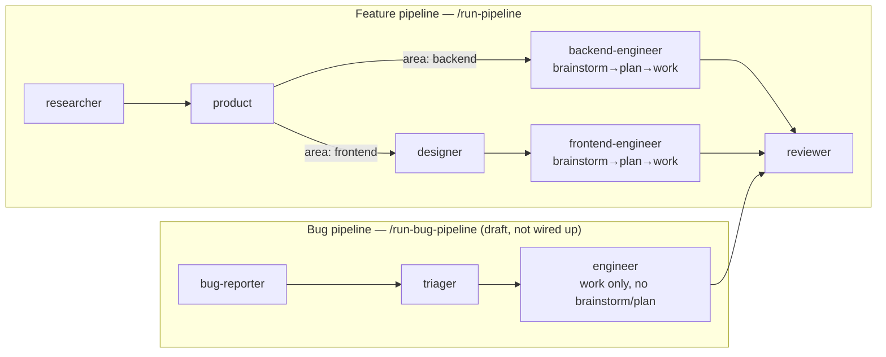

# Agent Pipeline

A document-driven pipeline of four Claude Code subagents that carries an idea
from web research to a merged pull request:



Each stage reads the previous stage's markdown artifact and writes its own. An
orchestrator slash command, run from your main session, dispatches the four
subagents in sequence and enforces the human checkpoints and the
engineer↔reviewer review loop.

## The agents

| Agent             | Model  | Reads              | Writes                 | Can't do         |
|-------------------|--------|--------------------|------------------------|------------------|
| researcher        | sonnet | the topic          | `research.md`          | run code / shell |
| product           | opus   | `research.md`      | `product-tasks.md`     | touch code / web |
| designer          | opus   | `product-tasks.md` (frontend tasks) + `DESIGN_STANDARDS.md` | `design-spec.md` + `DESIGN_STANDARDS.md` additions | touch code beyond DESIGN_STANDARDS.md / web |
| backend-engineer  | sonnet | `product-tasks.md` (+ brainstorms/plans into `task-plan.md` first, feature tasks only) | Go code + draft PR + `task-plan.md` + `engineering-notes.md` | — |
| frontend-engineer | sonnet | `product-tasks.md` + `design-spec.md` (+ brainstorms/plans into `task-plan.md` first, feature tasks only) | React code + draft PR + `task-plan.md` + `engineering-notes.md` + screenshots | — |
| reviewer          | sonnet | the PR diff (+ `design-spec.md` for frontend tasks, + `task-plan.md` for feature tasks, + screenshots for frontend tasks) | `review-log.md`        | edit code        |

Each product task is tagged `area: backend` or `area: frontend`. The
orchestrator dispatches the matching engineer: `backend-engineer` (`backend/` +
`GO_STANDARDS.md` + `cc-skills-golang`, `go build`/`go test`) or
`frontend-engineer` (`frontend/` + `FRONTEND_STANDARDS.md` + jeffallan
`react-expert`/`typescript-pro`, React/TS/Vite, `tsc`/`npm test`). The reviewer
uses the tag to pick which standards to check against.

Definitions live in `.claude/agents/`. The orchestrator is
`.claude/commands/run-pipeline.md`.

## How to run

```
/run-pipeline <topic>
```

The orchestrator:

1. Creates `pipeline/<slug>/` and dispatches the **researcher** →
   **checkpoint: you review the research**.
2. Dispatches the **product** agent, which returns a go/no-go decision
   (`proceed` / `reject` / `defer`). On reject/defer the pipeline stops. On
   proceed → **checkpoint: you review the tasks**.
3. For each task, in order: dispatches the area's engineer —
   **backend-engineer** or **frontend-engineer** per the task's `area` tag —
   (branch → code → draft PR), then the **reviewer**. The engineer↔reviewer loop
   runs automatically (max 3 rounds, then it escalates to you). On approval the
   PR is flipped from draft to ready → **checkpoint: you merge it**.

The two gates that matter are after research and after the product decision —
nothing is built until you have seen what will be built and why.

## Feature vs. bug tasks

`/run-pipeline` only ever produces feature tasks — the orchestrator passes
`task-type: feature` to the engineer, which runs an internal Brainstorm
(consider 2-3 approaches, pick one) and Plan (an ordered step list) before
Build, writing both to `task-plan.md`. This is autonomous, not a new
checkpoint. The separate bug pipeline (`bug-reporter → triager → engineer →
reviewer`, `/run-bug-pipeline`) is still draft/not wired up; once it is, its
tasks will carry `task-type: bug` and skip Brainstorm/Plan entirely — a bug
already has a known root cause and fix shape by the time it reaches the
engineer.

## Getting started — your first run

Prerequisites (one-time): `gh auth login` done, and the skill plugins installed
(`cc-skills-golang` for backend, `fullstack-dev-skills` for frontend).

1. Start a **fresh** Claude Code session in this repo (so the agents, the
   `/run-pipeline` command, and `.claude/settings.json` permissions all load).
2. Run `/run-pipeline <topic>` — e.g. `/run-pipeline rate limiting for the proxy`.
3. Review the research when it pauses. Approve, or refine the topic and re-run.
4. Review the product decision + tasks. Approve to let the engineers build.
5. Merge each approved PR when the pipeline hands it to you.

### Using research to *find* a project

If you don't yet know what to build, use the research step for discovery: seed
it with a direction (a domain, an interest, or "product ideas that fit this Go +
React platform") rather than a concrete feature. The researcher surveys options
and trade-offs into `research.md`; you pick one, and the product agent turns that
choice into tasks. Research is safe and read-only — run it as many times as you
like before committing to a direction.

## Running autonomously (supervised autopilot)

`/run-pipeline-auto <topic-or-slug>` runs the whole chain **without pausing** —
research → product → build → review — and leaves reviewer-approved PRs **ready
for you to merge** (it never merges). The one human gate that remains is the
merge: nothing reaches `main` without you.

- **No prompts:** `.claude/settings.json` sets `permissions.defaultMode: "auto"`,
  so routine commands (build, test, git, `gh pr`, docker) run without asking
  while genuinely destructive ones are still blocked. (Auto mode may show a
  one-time opt-in the first time.)
- **Stacked PRs:** dependent tasks branch off their dependency's branch, so the
  full chain builds unattended. Merge the base PR first; children retarget to
  `main` as their parent merges.
- **Resume:** if `pipeline/<slug>/product-tasks.md` already exists with
  `decision: proceed`, it skips research/product and goes straight to build —
  e.g. `/run-pipeline-auto rate-limiting` picks up the approved rate-limiting tasks.
- **Routine:** to run it on a schedule (a cron cloud agent), wrap
  `/run-pipeline-auto <slug>` in a scheduled task. Best for "keep advancing"
  cadence; a one-shot build is simpler run once, unattended, in a local session.

## Artifacts

Pipeline artifacts live in `pipeline/<slug>/` and are **gitignored** — they are
a local paper-trail, not part of the repo. Only the code the engineer writes
reaches the repo, via feature branches and PRs.

- `research.md` — readable prose (you review it).
- `product-tasks.md` — readable prose (you review it).
- `design-spec.md` — readable prose (you review it), sectioned by task,
  `area: frontend` tasks only.
- `screenshots/<taskid>/` — Playwright captures of every designed
  screen/state, committed on the task branch (force-added with `git add -f`
  — `pipeline/` is otherwise gitignored); the engineer self-checks them,
  the reviewer reads them, you see them on the PR.
- `task-plan.md` — caveman-compressed, sectioned by task. The engineer's own
  brainstorm (2-3 approaches considered, which was picked and why) + an
  ordered implementation checklist, written before any code — `task-type:
  feature` tasks only, not a checkpoint (autonomous).
- `engineering-notes.md` — caveman-compressed, sectioned by task.
- `review-log.md` — caveman-compressed, sectioned by task.

## One-time setup

The engineer opens real PRs with the GitHub CLI. Install and authenticate once:

```bash
brew install gh
gh auth login          # interactive browser flow — you must do this yourself
```

## Conventions

- The orchestrator owns the topic slug and hands every agent explicit paths;
  agents never derive paths themselves.
- The engineers apply `ponytail:ponytail` for the laziest working code:
  backend-engineer follows `GO_STANDARDS.md` (+ `cc-skills-golang`),
  frontend-engineer follows `FRONTEND_STANDARDS.md` (+ jeffallan
  `react-expert`/`typescript-pro`).
- The reviewer never edits code — it reviews and comments; the engineer fixes.
- Agents report back to the orchestrator in caveman style to keep the main
  session's context lean.
